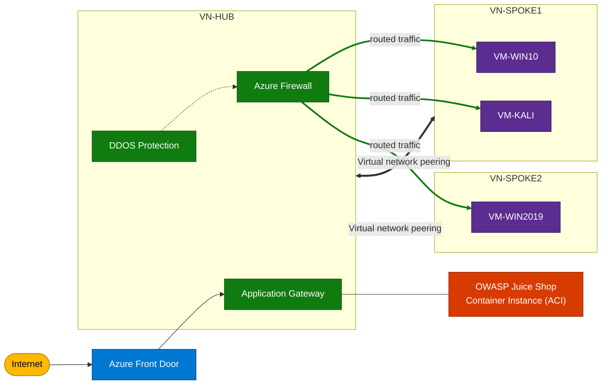

# Azure Network Security Demo Lab — Workshop

A guided, **step-by-step Azure PowerShell** workshop that builds a modernized
hub-and-spoke network security lab in **West US (`westus`)**. It is derived from the
Microsoft **Azure Network Security PoC** and the **NetSec Demo Lab** template, and
re-validated against current Microsoft Learn guidance.

> Governance: this lab is built to the rules in
> [`.specify/memory/constitution.md`](.specify/memory/constitution.md) (v2.0.1).

## Reference sources

1. **Azure Network Security PoC — Part 2 (Deploying the environment)**
   <https://techcommunity.microsoft.com/blog/azurenetworksecurityblog/azure-network-security-proof-of-concept-part-2-deploying-the-environment/1773168>
2. **Azure/Azure-Network-Security — NetSec Demo Lab README**
   <https://github.com/Azure/Azure-Network-Security/blob/master/Lab%20Templates/Lab%20Template%20-%20NetSec%20Demo%20Lab/README.md>

## What you will build

This mirrors the official **NetSec Demo Lab** reference architecture (Internet →
Azure Front Door → Application Gateway in the hub, with DDoS + Azure Firewall, the
OWASP Juice Shop demo app, and two peered spokes routed through the firewall).



> **Legend:** 🔵 Azure Front Door (edge) · 🟢 hub (DDoS / Firewall / App Gateway) ·
> 🟣 spoke VMs · 🟠 OWASP Juice Shop container · 🟡 Internet. Double arrows = VNet peering;
> green arrows = traffic routed through Azure Firewall.

> **Modernization note (Constitution Principle I):** the diagram keeps the original lab
> labels (VM-WIN10, VM-WIN2019), but the deployment scripts provision the current
> equivalents — **Windows 11** and **Windows Server 2022** — and add **Azure Bastion**
> for admin access. Image SKUs are parameterized in [`deploy/config.ps1`](deploy/config.ps1).

Resources: 3 VNets (peered hub-spoke), Azure Firewall **Premium** + policy with IDPS,
NSGs (deny-by-default), UDR forcing egress through the firewall, 3 VMs (Windows 11,
Kali Linux, Windows Server 2022), **Azure Bastion** (no public RDP/SSH), an **Azure
Container Instance** running OWASP Juice Shop, Application Gateway **WAFv2**, Front Door
**Premium** + WAF, Log Analytics, and an optional DDoS Network Protection plan.

> **Why a container instead of App Service?** Sponsored / MCAP subscriptions cap App
> Service VM quota at **0**, so the lab hosts the OWASP Juice Shop on **Azure Container
> Instances (ACI)** — a separate quota pool — and points the Application Gateway at the
> container's public FQDN over HTTP:3000. See [`deploy/config.ps1`](deploy/config.ps1)
> (`$DeployWebApp = $false` + `$WebAppBackendFqdn`).

> Out of scope by design (per the constitution): Microsoft Defender for Cloud and
> Microsoft Sentinel.

## Prerequisites

- **PowerShell 7+** and the **Az** module: `Install-Module Az -Scope CurrentUser`
- An Azure subscription with rights to create the above resources
- Quota for **≥ 6 vCPUs** of `Standard_D2s_v3` in `westus`
- `Connect-AzAccount` (module `00` will prompt if needed)

## Cost warning

The premium SKUs are **not free**. Approximate list prices (West US, subject to change):

| Resource | Approx. cost |
|---|---|
| Azure Firewall Premium | ~$1.75/hr + data |
| Front Door Premium | ~$330/mo base |
| Application Gateway WAFv2 | ~$0.36/hr + capacity units |
| Azure Bastion (Standard) | ~$0.19/hr |
| 3 × `Standard_D2s_v3` VMs | ~$0.30/hr total (when running) |
| DDoS Network Protection (optional) | ~$2,944/mo — **default OFF** |

**Always run `99-teardown.ps1` when finished.** Toggle expensive components in
[`deploy/config.ps1`](deploy/config.ps1).

## How to run

All scripts live in `deploy/` and share [`deploy/config.ps1`](deploy/config.ps1).
Edit the **EDIT ME** block in `config.ps1` first (prefix/suffix/region/toggles).

### Guided (recommended for the live workshop)

```powershell
cd deploy
./Deploy-All.ps1            # pauses at each checkpoint
```

> **Subscription selection.** On the first stage (`00-preflight`) the lab lists every enabled
> subscription your identity can access, lets you pick one, switches context, and asks you to type
> `yes` to confirm before any resource is created. For an unattended run, pass the subscription
> name or id explicitly to skip the prompt:
>
> ```powershell
> $cred = Get-Credential azureadmin
> ./Deploy-All.ps1 -AdminCredential $cred -SubscriptionId '<name-or-id>' -NoPause
> ```

### One module at a time

```powershell
cd deploy
./00-preflight.ps1         # sign in, pick/confirm subscription, validate region/SKU/quota, create RG
./01-networking.ps1        # VNets, subnets, peering, public IPs
./02-security-core.ps1     # Firewall Premium + IDPS, NSGs, UDR, (optional DDoS)
./03-compute.ps1           # 3 VMs (prompts for VM password) + Bastion
./04-app-delivery.ps1      # Juice Shop (ACI) backend + App Gateway WAFv2 + Front Door Premium
./05-monitoring.ps1        # Log Analytics + diagnostic settings
```

### Teardown

```powershell
cd deploy
./99-teardown.ps1          # confirms, then deletes the whole resource group
```

## Module checkpoints

| Module | Objective | Validate (checkpoint) |
|---|---|---|
| `00-preflight` | Sign in + availability gate | RG exists; region/SKU/quota OK |
| `01-networking` | Hub-spoke backbone | 3 peered VNets + 3 public IPs |
| `02-security-core` | Firewall + segmentation | Firewall private IP printed; NSG/UDR on spokes |
| `03-compute` | Lab VMs + admin access | 3 VMs running; connect via Bastion |
| `04-app-delivery` | Layered web protection | Front Door endpoint reachable |
| `05-monitoring` | Centralized logs | Diagnostics flowing to workspace |

## Workshop walkthrough

This is the suggested flow for running the lab as a guided session (~half a day). The formal
requirements behind it live in [specs/001-netsec-demo-lab/spec.md](specs/001-netsec-demo-lab/spec.md).

> 📘 **New to these services?** A detailed, beginner‑friendly walkthrough — with every Azure service
> explained in plain language and copy‑paste commands for all scenarios (including firewall FQDN
> filtering, inbound IDPS via DNAT, and a custom App Gateway WAF rule) — is in
> [docs/WORKSHOP-WALKTHROUGH.md](docs/WORKSHOP-WALKTHROUGH.md).

### Part A — Setup (15 min)

1. **Prerequisites check.** Confirm PowerShell 7+, the `Az` module, and an Azure subscription with
   quota for ≥ 6 vCPUs of `Standard_D2s_v3` in `westus`.
2. **Docker Hub account (for the ACI backend).** The OWASP Juice Shop image is pulled from Docker
   Hub, which **rate-limits anonymous pulls** (causing `RegistryErrorResponse` on
   `az container create`). Sign up for a free account at <https://hub.docker.com>, create an
   **access token** (Account Settings → Security), and expose the credentials as environment
   variables **before** building so nothing secret is stored in the repo:

   ```powershell
   $env:DOCKERHUB_USERNAME = '<your-docker-id>'
   $env:DOCKERHUB_PASSWORD = '<your-access-token>'   # token preferred over password
   ```

3. **Cost briefing.** Walk through the [cost table](#cost-warning). Stress that **teardown is
   mandatory** and that **DDoS defaults OFF**.
4. **Configure.** Open [`deploy/config.ps1`](deploy/config.ps1), edit the **EDIT ME** block
   (prefix, suffix, region, feature toggles). Explain that region is a single variable
   (Constitution Principle III).

### Part B — Guided build (90–120 min)

Run `./Deploy-All.ps1` and pause at each checkpoint to explain *what* and *why*:

| Stage | Talking points while it deploys |
|---|---|
| `00-preflight` | Why an availability gate prevents half-built labs; show the subscription pick/confirm prompt and the region/SKU/quota checks. |
| `01-networking` | Hub-and-spoke topology; why spokes peer to the hub but not each other. |
| `02-security-core` | Default-deny NSGs; UDR forced tunneling; Firewall Premium + IDPS. |
| `03-compute` | Bastion-only admin (no public IPs); secure credential prompt; marketplace terms. |
| `04-app-delivery` | Defense-in-depth: Front Door WAF → App Gateway WAF → Juice Shop container. |
| `05-monitoring` | Centralized Log Analytics; what telemetry each resource emits. |

> Tip: for an unattended demo, pre-run the build with
> `$cred = Get-Credential azureadmin; ./Deploy-All.ps1 -AdminCredential $cred -SubscriptionId '<name-or-id>' -NoPause` before the
> session, then walk the audience through the deployed resources.

### Part C — Demonstration scenarios (45–60 min)

Each scenario maps to **User Story 2** in the spec — run it, then show the observable result.

#### Scenario 1 — WAF blocks a web attack

- **Do:** From the Kali VM (via Bastion), send a simulated OWASP-style request (e.g. an SQL-injection
  query string) to the Front Door endpoint printed by module `04`.
- **Observe:** The request is blocked (HTTP 403). In the portal, open the Front Door / Application
  Gateway WAF logs (or query the Log Analytics workspace) and show the matched managed rule.
- **Teaches:** Layered L7 protection and WAF Prevention mode.

#### Scenario 2 — Firewall intrusion detection (IDPS) alert

- **Do:** From a spoke VM, generate traffic that matches an IDPS signature (e.g. an EICAR test
  download over the allowed outbound path).
- **Observe:** Query the Log Analytics workspace for `AZFWIdpsSignature` records and show the alert.
- **Teaches:** Azure Firewall **Premium** IDPS in Alert mode.

#### Scenario 3 — Default-deny segmentation

- **Do:** From the Spoke1 Kali VM, attempt an unsanctioned connection to a Spoke2 VM port that the
  firewall rules do not permit.
- **Observe:** The connection is denied. Contrast with a permitted admin port (3389/22/445) defined
  in the firewall network rule collection.
- **Teaches:** NSG default-deny + firewall east-west control.

#### Scenario 4 — Forced-tunnel egress

- **Do:** From a spoke VM, browse to an allowed FQDN (e.g. `www.bing.com`) and to a disallowed one.
- **Observe:** Allowed FQDNs succeed and appear in firewall application-rule logs; disallowed traffic
  is dropped — proving all egress is routed through the firewall by UDR.
- **Teaches:** User-defined routing and outbound FQDN filtering.

#### Scenario 5 — Firewall FQDN filtering (allowed vs blocked)

- **Do:** From the Win11 or Kali VM, request an allowed site (`www.microsoft.com`) and a blocked one
  (`www.facebook.com`).
- **Observe:** Allowed succeeds; blocked returns the firewall's `HTTP 470 — Action: Deny. No rule
  matched.` message (the firewall itself answers, proving inspection).
- **Teaches:** Outbound FQDN allow‑listing via firewall application rules.

#### Scenario 6 — Inbound IDPS via DNAT (optional, advanced)

- **Do:** Add a firewall **DNAT** rule publishing a port on the firewall's public IP to a spoke VM,
  then send an exploit‑style request from the internet.
- **Observe:** IDPS logs an **inbound** `AZFWIdpsSignature` alert. **Remove the DNAT rule afterwards.**
- **Teaches:** DNAT publishing + bidirectional IDPS inspection.

#### Scenario 7 — Application Gateway custom WAF rule (optional)

- **Do:** Add a custom WAF rule (e.g. block `User-Agent: evilbot`) to the App Gateway policy, then
  test with two requests.
- **Observe:** Normal request → 200; matching request → 403. **Remove the custom rule afterwards.**
- **Teaches:** Custom WAF rules complement the managed OWASP rule set.

#### Scenario 8 — Application Gateway WAF geo-blocking (optional)

- **Do:** Add a custom WAF rule with a `GeoMatch` condition to the App Gateway policy to block a
  country by its IP geo-location (do it via the CLI **or** the Azure Portal).
- **Observe:** A request from an allowed country → 200; once you block your own country → 403.
  **Remove the rule afterwards** so you don't lock yourself out.
- **Teaches:** Geo-based access control — the same WAF enforces business/geography rules, not just
  attack signatures.

> Full commands for Scenarios 5–8 are in [docs/WORKSHOP-WALKTHROUGH.md](docs/WORKSHOP-WALKTHROUGH.md).

### Part D — Teardown (10 min)

Run `./99-teardown.ps1`, confirm the resource-group name when prompted, and show that billing stops
once deletion completes. Reinforce that everything lives in one resource group for exactly this reason.

### Facilitator checklist

- [ ] Prerequisites verified and cost briefing delivered
- [ ] `config.ps1` reviewed with the audience
- [ ] All six build stages passed their checkpoints
- [ ] All four demonstration scenarios produced their expected result
- [ ] Lab torn down and billing confirmed stopped

## Security & design notes


- **No secrets in source.** The VM admin password is collected at runtime via
  `Get-Credential` (module `03`).
- **Bastion-only admin.** VMs have **no public IPs**; NSGs deny inbound from the
  Internet and allow RDP/SSH only from the Bastion subnet.
- **Forced tunneling.** A UDR sends `0.0.0.0/0` from spoke subnets to the firewall.
- **Documented deviation (Principle I).** Azure Bastion is placed in the **hub**
  (not a spoke) so it reaches every spoke over peering — the standard hub-spoke pattern.
- **Modernization (Principle I).** Windows Server 2019 in the original lab is updated
  to **2022**; image SKUs are parameterized in `config.ps1` — verify currency with
  `Get-AzVMImageSku` if a deployment reports an unavailable image.
- **Premium demonstrator.** Firewall **IDPS** (Alert mode) showcases the Premium tier
  without TLS-inspection certificate complexity. TLS inspection (Key Vault + managed
  identity) is an optional advanced add-on.

## Troubleshooting

- *Image not found* → run `Get-AzVMImageSku -Location westus -PublisherName <pub> -Offer <offer>`
  and update the SKU in `config.ps1`.
- *Quota errors* → request an increase, or lower `$VmSize` in `config.ps1`.
- *Kali fails to deploy* → ensure marketplace terms were accepted (module `03` does
  this automatically with `Set-AzMarketplaceTerms`).
- Re-running a module is safe: each resource is created only if it does not already exist.
