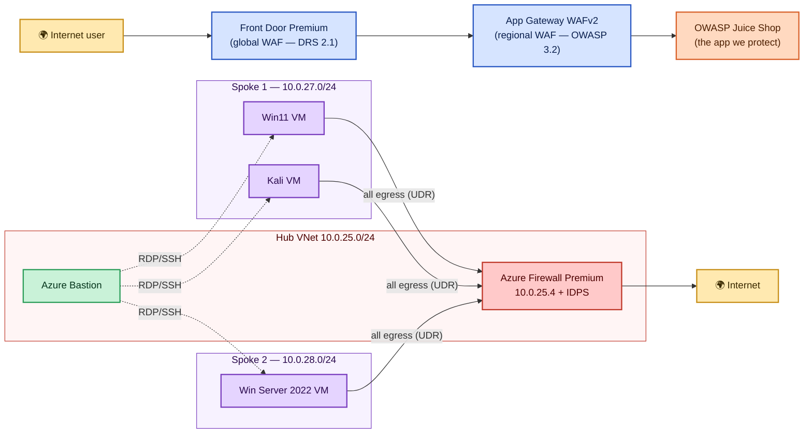

# Azure Network Security Demo Lab — Detailed Workshop Walkthrough

> **Who this is for:** people who are *new* to Azure networking and security services.
> Every service is explained in plain language before you use it, and every command is
> copy‑paste ready. If you have run the lab before and just want the short version, use
> the [walkthrough section in the README](../README.md#workshop-walkthrough).

---

## Table of contents

1. [What you are building (and why)](#1-what-you-are-building-and-why)
2. [Plain‑language glossary of every service](#2-plainlanguage-glossary-of-every-service)
3. [How traffic flows through the lab](#3-how-traffic-flows-through-the-lab)
4. [Before you start](#4-before-you-start)
5. [Build the lab, stage by stage](#5-build-the-lab-stage-by-stage)
6. [Demonstration scenarios](#6-demonstration-scenarios)
   - [Connecting to the lab VMs (Win11 via Bastion RDP)](#connecting-to-the-lab-vms-win11-via-bastion-rdp)
   - [S1 — WAF blocks a web attack (403)](#s1--waf-blocks-a-web-attack-403)
   - [S2 — Firewall FQDN filtering: allowed vs blocked](#s2--firewall-fqdn-filtering-allowed-vs-blocked)
   - [S3 — Default‑deny segmentation](#s3--defaultdeny-segmentation)
   - [S4 — Forced‑tunnel egress through the firewall](#s4--forcedtunnel-egress-through-the-firewall)
   - [S5 — Firewall IDPS: outbound intrusion detection](#s5--firewall-idps-outbound-intrusion-detection)
   - [S6 — Firewall IDPS: testing *incoming* attacks (DNAT)](#s6--firewall-idps-testing-incoming-attacks-dnat)
   - [S7 — Application Gateway WAF: add a custom rule](#s7--application-gateway-waf-add-a-custom-rule)
   - [S8 — Application Gateway WAF: block a country (geo‑filtering)](#s8--application-gateway-waf-block-a-country-geofiltering)
   - [S9 — Read the telemetry in Log Analytics](#s9--read-the-telemetry-in-log-analytics)
7. [Teardown (mandatory)](#7-teardown-mandatory)
8. [Troubleshooting & gotchas we hit live](#8-troubleshooting--gotchas-we-hit-live)
9. [Facilitator checklist](#9-facilitator-checklist)

---

## 1. What you are building (and why)

You are building a small but realistic **"defense‑in‑depth"** network in Azure. *Defense‑in‑depth*
just means **layers of protection** — if one layer misses an attack, the next one catches it. A real
company would protect a web application the same way.

The lab proves five security ideas:

| Idea | What it means in plain English |
|------|--------------------------------|
| **Web Application Firewall (WAF)** | A bouncer that inspects web requests and blocks attacks like SQL injection / cross‑site scripting *before* they reach your app. |
| **Network segmentation** | Splitting your network into separate rooms so a problem in one room can't spread to the others. |
| **Default‑deny** | "Block everything unless I explicitly allow it" — the opposite of leaving doors open. |
| **Forced tunneling** | Making *all* outbound internet traffic go through one inspected exit (the firewall), so nothing sneaks out. |
| **IDPS (Intrusion Detection & Prevention)** | A security camera on the firewall that recognizes known attack patterns and raises an alert. |

---

## 2. Plain‑language glossary of every service

Read this once. You will meet each of these as you build.

### Networking building blocks

- **Resource Group** — a folder that holds every resource for this lab. Deleting the folder deletes
  everything (that is how we guarantee billing stops). Ours is `rg-netsec-demo`.
- **Virtual Network (VNet)** — your private network in Azure, like a building. We have **three**:
  one **hub** (shared services) and two **spokes** (workloads).
- **Subnet** — a floor inside the building. Each VNet is divided into subnets.
- **Hub‑and‑spoke** — a common design: a central **hub** VNet connects to multiple **spoke** VNets.
  The spokes talk to the hub, **not directly to each other** — that isolation is the point.
- **VNet peering** — the "hallways" that connect the hub to each spoke.
- **Network Security Group (NSG)** — a basic firewall attached to a subnet. It is a list of
  allow/deny rules for traffic in and out. We set ours to **deny by default**.
- **User‑Defined Route (UDR) / Route Table** — overrides Azure's default routing. We use it to force
  `0.0.0.0/0` (meaning *everywhere on the internet*) to go **through the firewall** first.

### Security services

- **Azure Firewall Premium** — a managed, cloud‑scale firewall. "Premium" adds **IDPS** (intrusion
  detection) and TLS inspection. It sits in the hub and inspects traffic between spokes and to the
  internet. Ours is `NS-FW-demo` at private IP `10.0.25.4`.
- **Firewall Policy** — the rulebook the firewall follows (which FQDNs/ports are allowed). Ours is
  `NS-FWPolicy-demo`. Rules live in **rule collection groups**.
- **IDPS (Intrusion Detection and Prevention System)** — inspects the *content* of allowed traffic
  for known attack signatures. In **Alert** mode it logs but does not block; in **Deny** mode it
  blocks. Ours is in **Alert** mode.
- **DDoS Protection** — defends against volumetric flood attacks. **OFF by default** in this lab
  because it costs ~$2,944/month.

### Web delivery & protection

- **OWASP Juice Shop** — a deliberately *vulnerable* demo web app (safe to attack, it is built for
  training). It is our "backend" — the thing we are protecting. We run it as a container on **Azure
  Container Instances (ACI)** (`ns-juice-aci`), because sponsored subscriptions cap App Service quota
  at 0. The container's image comes from **Docker Hub** (`bkimminich/juice-shop`).
- **Application Gateway WAFv2** — a regional web load balancer **with a built‑in WAF**. It inspects
  web requests using the **OWASP managed rule set** and blocks attacks. Ours is `NS-AG-WAFv2-demo`.
- **Azure Front Door Premium** — a **global** entry point (CDN + WAF) that sits in front of
  everything. It terminates the user's connection at the nearest Microsoft edge location worldwide,
  runs its **own WAF**, then forwards to the Application Gateway. Ours is `NS-FD-demo`.
- **WAF policy / managed rules** — the rulebook each WAF follows. Front Door uses **DRS (Default Rule
  Set) 2.1**; App Gateway uses **OWASP 3.2**. Both run in **Prevention** (blocking) mode.

### Access & monitoring

- **Azure Bastion** — lets you RDP/SSH into VMs **through the Azure portal**, so the VMs need **no
  public IP address**. This is much safer than exposing RDP/SSH to the internet. Ours is
  `NS-BASTION-demo` (Standard SKU).
- **Log Analytics workspace** — a central database for logs. Every security service sends its logs
  here so you can query them with **KQL** (Kusto Query Language). Ours is `NS-LA-demo`.
- **Diagnostic settings** — the "pipe" that connects a resource's logs to the Log Analytics
  workspace. **If this pipe is missing, no logs arrive** (we learned this the hard way — see
  [gotchas](#8-troubleshooting--gotchas-we-hit-live)).

---

## 3. How traffic flows through the lab



> 🎨 **Colour key:** 🟡 Internet · 🔵 WAF layers (Front Door, App Gateway) · 🟠 the app ·
> 🔴 Firewall/security · 🟢 Bastion (access) · 🟣 spoke VMs.

**Two separate paths to understand:**

- **Inbound web traffic** (a user visiting the app) goes **Front Door → App Gateway → Juice Shop**.
  Two WAF layers inspect it.
- **Outbound traffic from the VMs** (a VM browsing the internet) is **forced through the firewall**
  by the UDR, where firewall rules + IDPS inspect it.

---

## 4. Before you start

### Tools you need

| Tool | Why | Check it |
|------|-----|----------|
| **PowerShell 7+** (`pwsh`) | Runs the deploy scripts | `pwsh --version` |
| **Az PowerShell module** | Azure cmdlets | `Get-Module Az.Accounts -ListAvailable` |
| **Azure CLI** (`az`) | Used for the ACR/ACI backend and a few steps where it is more reliable | `az version` |
| **An Azure subscription** | Somewhere to deploy | `az account show` |

> **No Docker Hub account required.** Pulling the Juice Shop image directly from Docker Hub
> (`docker.io`) is unreliable — anonymous pulls are **rate-limited** (`RegistryErrorResponse`) and
> basic auth is **rejected when the account has 2FA** (`InaccessibleImage`). Instead, this lab
> imports the image **once** into a private **Azure Container Registry** (a server-side copy — no
> local Docker, no Docker Hub login on the client) and runs ACI from ACR. The
> [`deploy/create-aci.ps1`](../deploy/create-aci.ps1) script automates the whole flow.

> **Quota note (important for sponsored / MCAP subscriptions):** App Service plans need dedicated VM
> quota, which some sponsored subscriptions cap at **0**. If `New-AzAppServicePlan` fails, host the
> Juice Shop on **Azure Container Instances (ACI)** instead — `config.ps1` already supports pointing
> the App Gateway at an ACI FQDN (`$DeployWebApp = $false` + `$WebAppBackendFqdn`).

### Sign in

```powershell
Connect-AzAccount -UseDeviceAuthentication   # device-code login (works when browser popup hangs)
az login                                       # also sign in the CLI (its token auto-refreshes)
```

> **Tip we learned live:** the **Az PowerShell** token expires after ~1 hour and does *not*
> auto‑refresh, but the **`az` CLI** token does. If a `New-Az…` command suddenly returns a vague
> "401 Unauthorized", try the same operation with `az` — it often reveals the *real* error (such as a
> quota limit) and keeps working.

---

## 5. Build the lab, stage by stage

Run from the `deploy/` folder. Each script is **idempotent** — safe to re‑run; it only creates what
is missing.

```powershell
cd deploy
./00-preflight.ps1      # sign-in + region/SKU/quota gate + resource group
./01-networking.ps1     # hub + 2 spokes, peering, public IPs
./02-security-core.ps1  # Firewall Premium + IDPS, NSGs, UDR (DDoS optional/off)
./03-compute.ps1        # 3 VMs (prompts for a VM password) + Bastion
./create-aci.ps1        # Juice Shop backend on ACI via ACR (no Docker Hub login needed)
./04-app-delivery.ps1   # Juice Shop backend + App Gateway WAFv2 + Front Door Premium WAF
./05-monitoring.ps1     # Log Analytics workspace + diagnostic settings
```

> **One step — create the Juice Shop container (ACI) via ACR.** Because App Service quota is 0 on
> sponsored subs, the backend is an **Azure Container Instance**. Run the helper script once (before
> or just after `04`). It is idempotent and pulls the image reliably through a private Azure
> Container Registry — **no Docker Hub login needed**:
>
> ```powershell
> ./create-aci.ps1
> ```
>
> Under the hood it runs (names come from `config.ps1`):
>
> ```powershell
> az acr create -g rg-netsec-demo -n nsdemoacrbibrani --sku Basic --admin-enabled true
> az acr import -n nsdemoacrbibrani --source docker.io/bkimminich/juice-shop:latest --image juice-shop:latest
> $u = az acr credential show -n nsdemoacrbibrani --query username -o tsv
> $p = az acr credential show -n nsdemoacrbibrani --query passwords[0].value -o tsv
> az container create `
>   --resource-group rg-netsec-demo `
>   --name ns-juice-aci `
>   --image nsdemoacrbibrani.azurecr.io/juice-shop:latest `
>   --os-type Linux --cpu 1 --memory 1.5 `
>   --ports 3000 --ip-address Public `
>   --dns-name-label ns-juice-demo-bibrani `
>   --registry-login-server nsdemoacrbibrani.azurecr.io `
>   --registry-username $u --registry-password $p
> ```
>
> Then confirm it is reachable:
> `curl.exe http://ns-juice-demo-bibrani.westus.azurecontainer.io:3000`

…or run them all with pauses for narration:

```powershell
./Deploy-All.ps1        # stops at each checkpoint so you can explain what just happened
```

### What to say while each stage runs

| Stage | Plain‑language talking point |
|-------|------------------------------|
| `00-preflight` | "We check region, VM size availability, and quota *first* so we never end up with a half‑built lab." |
| `01-networking` | "Here is the building (hub) and two workspaces (spokes). Notice the spokes connect to the hub, not to each other." |
| `02-security-core` | "Now we add the firewall, lock every subnet to *deny by default*, and force all internet traffic through the firewall." |
| `03-compute` | "Three VMs go in — but none has a public IP. The only way in is Bastion. That alone removes the #1 attack surface." |
| `04-app-delivery` | "Two WAF layers in front of a deliberately vulnerable app: a global one (Front Door) and a regional one (App Gateway)." |
| `05-monitoring` | "Every service streams its logs to one place so we can prove, with data, that the controls fired." |

### Validate each checkpoint

```powershell
Get-AzResourceGroup -Name rg-netsec-demo                      # after 00
Get-AzVirtualNetwork -ResourceGroupName rg-netsec-demo        # after 01 → 3 VNets
Get-AzFirewall -ResourceGroupName rg-netsec-demo              # after 02 → Premium + private IP
Get-AzVM -ResourceGroupName rg-netsec-demo                    # after 03 → 3 VMs, no public IPs
# after 04 → curl the Front Door endpoint URL printed by the script (expect HTTP 200)
Get-AzOperationalInsightsWorkspace -ResourceGroupName rg-netsec-demo   # after 05
```

---

## 6. Demonstration scenarios

> Replace the example Front Door hostname below with the one **your** `04` script printed
> (it looks like `https://ns-fd-demo-xxxxxxxx.b01.azurefd.net`).

### Connecting to the lab VMs (Win11 via Bastion RDP)

Most scenarios need you to run a command **from inside a lab VM**. None of the VMs have a public IP,
so you reach them through **Azure Bastion** — a secure RDP/SSH gateway built into the portal. **No VPN,
no RDP client, nothing to install** — it all happens in your browser.

> 👍 **For a newcomer audience, use the Windows 11 VM (`NS-W11-demo`).** It has a normal Windows
> desktop, the **Edge browser**, and **PowerShell** with `curl.exe` already built in — so you avoid
> the Kali quirks (Kali's minimal image has no `curl`, uses `zsh`, and needs `bash` `/dev/tcp` tricks).
> The Kali VM is only really needed for the IDPS "attack pattern" payload in **S5**.

**Connect (do this once, then keep the tab open for all scenarios):**

1. Azure portal → search **"Virtual machines"** → open **`NS-W11-demo`**.
2. Top menu → **Connect → Connect via Bastion**.
3. Enter username **`azureadmin`** and the VM password, then **Connect**.
4. A full **Windows 11 desktop** opens in a new browser tab. Click **Start → type "PowerShell" → Enter**
   to get a terminal, or open **Edge** for the browser‑based demos.

**Which scenarios you can drive from the Win11 desktop:**

| Scenario | From Win11? | How (inside the Bastion session) |
|----------|:----------:|----------------------------------|
| **S2 / S4 — FQDN filtering & forced tunnel** | ✅ *best here* | Open **Edge**: `https://www.microsoft.com` loads, `https://www.facebook.com` shows the firewall's **HTTP 470 “Deny”** page. (Very visual for an audience.) |
| **S1 / S7 / S8 — WAF block, custom rule, geo‑block** | ✅ | Open **PowerShell**, run the same `curl.exe` commands against the Front Door URL. |
| **S3 — segmentation deny** | ✅ | PowerShell: `Test-NetConnection 10.0.28.4 -Port 445` → expect `TcpTestSucceeded : False`. |
| **S5 — IDPS attack pattern** | ⚠️ use Kali | The exploit‑style payload is easiest from Kali; Win11 can browse `http://testmynids.org/uid/index.html` but the malicious signature demo is cleaner on Kali. |
| **S6 — inbound IDPS (DNAT)** | n/a | Driven *from the internet*, not from a VM. |

**The same commands, run inside the Win11 Bastion session:**

```powershell
# S2/S4 — FQDN filtering: allowed vs blocked
curl.exe -s -o NUL -w "microsoft.com -> HTTP %{http_code}`n" http://www.microsoft.com
curl.exe -s -o NUL -w "facebook.com  -> HTTP %{http_code}`n" http://www.facebook.com   # firewall denies

# S3 — segmentation: an east-west port the firewall does not allow
Test-NetConnection 10.0.28.4 -Port 445        # expect TcpTestSucceeded : False

# S1 — WAF block via Front Door (use YOUR endpoint)
$FD = "https://ns-fd-demo-bhagh9aqfxcwapfc.b01.azurefd.net"
curl.exe -s -o NUL -w "normal -> HTTP %{http_code}`n" "$FD/"
curl.exe -s -o NUL -w "SQLi   -> HTTP %{http_code}`n" "$FD/?id=1%20OR%201=1--"
```

> 💡 **Why this proves something:** Win11's internet traffic is **forced through the firewall** by the
> UDR (its source IP is `10.0.27.4`), exactly like Kali's. So whatever you do here also shows up in the
> firewall logs in [S9](#s9--read-the-telemetry-in-log-analytics) — the Win11 VM is a first‑class demo
> machine, not a second‑class one.

---

### S1 — WAF blocks a web attack (403)

**Goal:** prove the Front Door WAF blocks OWASP attacks while letting normal traffic through.

**What is happening:** a normal request is allowed (HTTP 200). A request containing a SQL‑injection or
cross‑site‑scripting (XSS) pattern matches a WAF rule and is rejected (HTTP 403) at the Microsoft edge —
it never reaches the app.

Run from your **local pwsh**:

```powershell
$FD = "https://ns-fd-demo-bhagh9aqfxcwapfc.b01.azurefd.net"   # ← use YOUR endpoint

"--- Normal request (expect 200) ---"
curl.exe -s -o NUL -w "HTTP %{http_code}`n" "$FD/"

"--- SQL injection (expect 403) ---"
curl.exe -s -o NUL -w "HTTP %{http_code}`n" "$FD/?id=1%20OR%201=1--"

"--- XSS (expect 403) ---"
curl.exe -s -o NUL -w "HTTP %{http_code}`n" "$FD/?q=<script>alert(1)</script>"
```

**Expected:** `200`, `403`, `403`.
**Teaches:** layered L7 protection and WAF **Prevention** mode.

---

### S2 — Firewall FQDN filtering: allowed vs blocked

**Goal:** prove the firewall only lets VMs reach an **approved list of websites** and blocks the rest.

**What is happening:** the firewall policy's `Allow-Web` application rule permits only a curated list
(`*.microsoft.com`, `*.google.com`, `www.bing.com`, `*.ubuntu.com`, `*.kali.org`). Everything else hits
**default‑deny**, and the firewall answers with an HTTP **470** "Deny" message.

#### Option A — from the Windows 11 VM (portal Bastion)

1. Azure portal → VM **`NS-W11-demo`** → **Connect → Bastion** → username `azureadmin` + your password.
2. Inside the Win11 session, open **PowerShell** and run:

```powershell
"--- ALLOWED (expect success) ---"
try { (Invoke-WebRequest http://www.microsoft.com -UseBasicParsing -TimeoutSec 15).StatusCode }
catch { $_.Exception.Message }

"--- BLOCKED by firewall (expect deny/timeout) ---"
try { (Invoke-WebRequest http://www.facebook.com -UseBasicParsing -TimeoutSec 15).StatusCode }
catch { $_.Exception.Message }
```

#### Option B — from the Kali VM (fast, no GUI)

The minimal Kali image has **no `curl`** and uses **zsh** (no `/dev/tcp`), so wrap the call in `bash`:

```bash
echo "--- ALLOWED (microsoft.com) ---"
bash -c 'exec 3<>/dev/tcp/www.microsoft.com/80; printf "GET / HTTP/1.1\r\nHost: www.microsoft.com\r\nConnection: close\r\n\r\n" >&3; head -1 <&3; exec 3>&-'

echo "--- BLOCKED (facebook.com) ---"
timeout 10 bash -c 'exec 3<>/dev/tcp/www.facebook.com/80; printf "GET / HTTP/1.1\r\nHost: www.facebook.com\r\nConnection: close\r\n\r\n" >&3; head -1 <&3; exec 3>&-' || echo "DENIED/TIMEOUT (firewall blocked)"
```

**Expected:** microsoft.com → `HTTP/1.1 200/301`; facebook.com → `HTTP/1.1 470 … Deny` or a timeout.
**Teaches:** outbound **FQDN filtering** via firewall application rules.

---

### S3 — Default‑deny segmentation

**Goal:** prove that traffic the firewall does **not** explicitly allow is dropped.

**What is happening:** any flow that matches **no allow rule** is denied by the firewall's default
action. You see the same HTTP **470** "Deny. Reason: No rule matched." response — that message comes
from the **firewall itself**, not the destination.

From the **Kali VM** (Bastion), reach a site that is *not* on the allow‑list:

```bash
bash -c 'exec 3<>/dev/tcp/example.com/80; printf "GET / HTTP/1.1\r\nHost: example.com\r\nConnection: close\r\n\r\n" >&3; cat <&3; exec 3>&-'
```

**Expected:** `HTTP/1.1 470 … Action: Deny. Reason: No rule matched. Proceeding with default action.`
**Teaches:** NSG default‑deny + firewall east‑west/egress control.

---

### S4 — Forced‑tunnel egress through the firewall

**Goal:** prove that **all** VM internet traffic is routed through the firewall (nothing bypasses it).

**What is happening:** the UDR sends `0.0.0.0/0` to the firewall's private IP `10.0.25.4`. The proof is
the same 470 response in S2/S3 — the only thing that can answer with that message is the firewall, so
the traffic *must* be passing through it. You can also confirm the route:

```powershell
az network route-table route list -g rg-netsec-demo --route-table-name NS-RT-demo `
  --query "[].{Name:name, Prefix:addressPrefix, NextHop:nextHopType, IP:nextHopIpAddress}" -o table
```

**Expected:** a `default-to-firewall` route → `0.0.0.0/0` → `VirtualAppliance` → `10.0.25.4`.
**Teaches:** user‑defined routing and outbound inspection.

---

### S5 — Firewall IDPS: outbound intrusion detection

**Goal:** make the firewall's **Intrusion Detection** raise a signature alert.

**What is happening:** IDPS inspects the *content* of **allowed** traffic. We first allow the test host,
then fetch a well‑known test response whose body — `uid=0(root) gid=0(root) groups=0(root)` — matches the
signature *"GPL ATTACK_RESPONSE id check returned root"*. Because IDPS is in **Alert** mode, the traffic
is allowed (HTTP 200) **and** logged.

**Step 1 — allow the test host** (so default‑deny doesn't block the payload). Run in **local pwsh**:

```powershell
az network firewall policy rule-collection-group collection add-filter-collection `
  --resource-group rg-netsec-demo `
  --policy-name NS-FWPolicy-demo `
  --rule-collection-group-name LabRuleCollectionGroup `
  --name Allow-IDPS-Test `
  --collection-priority 310 `
  --action Allow `
  --rule-name allow-testmynids `
  --rule-type ApplicationRule `
  --target-fqdns "testmynids.org" `
  --source-addresses "10.0.27.0/24" "10.0.28.0/24" `
  --protocols Http=80 Https=443
```

> If you get "The request is invalid", another collection is using that priority — pick a free number
> (e.g. `310`, `320`). List existing ones with
> `az network firewall policy rule-collection-group show -g rg-netsec-demo --policy-name NS-FWPolicy-demo --name LabRuleCollectionGroup -o json`.

**Step 2 — trigger the signature** from the **Kali VM** (Bastion). Fire it several times:

```bash
for i in 1 2 3 4 5; do bash -c 'exec 3<>/dev/tcp/testmynids.org/80; printf "GET /uid/index.html HTTP/1.1\r\nHost: testmynids.org\r\nConnection: close\r\n\r\n" >&3; cat <&3; exec 3>&-'; echo "--- hit $i ---"; done
```

**Expected:** `HTTP/1.1 200 OK` with body `uid=0(root) gid=0(root) groups=0(root)`.

**Step 3 — see the alert** (after 5–15 min ingestion — see [S9](#s9--read-the-telemetry-in-log-analytics)):

```powershell
$wsId = az monitor log-analytics workspace show -g rg-netsec-demo -n NS-LA-demo --query customerId -o tsv
az monitor log-analytics query --workspace $wsId `
  --analytics-query "AZFWIdpsSignature | where TimeGenerated > ago(1h) | project TimeGenerated, SourceIp, DestinationIp, Description, Action | order by TimeGenerated desc | take 20" -o table
```

**Teaches:** Azure Firewall **Premium** IDPS in Alert mode.

---

### S6 — Firewall IDPS: testing *incoming* attacks (DNAT)

**Goal:** demonstrate IDPS inspecting **inbound** traffic from the internet (not just outbound).

**What is happening:** by default nothing is published *inbound* through the firewall. To test incoming
attacks you add a **DNAT (Destination NAT) rule** that publishes a port on the firewall's **public IP**
and forwards it to a VM. Then you send an attack from the internet to `firewallPublicIP:port`; IDPS
inspects the inbound flow and logs the signature.

**Step 1 — get the firewall's public IP:**

```powershell
$fwPip = az network public-ip show -g rg-netsec-demo -n NS-FW-PIP-demo --query ipAddress -o tsv
"Firewall public IP: $fwPip"
```

**Step 2 — add a DNAT rule** publishing TCP 8080 → a spoke VM's web port (here the Win11 VM at
`10.0.27.4:80`; start a simple listener on it first, or point at any internal service):

```powershell
az network firewall policy rule-collection-group collection add-nat-collection `
  --resource-group rg-netsec-demo `
  --policy-name NS-FWPolicy-demo `
  --rule-collection-group-name LabRuleCollectionGroup `
  --name DNAT-Inbound-Test `
  --collection-priority 400 `
  --action DNAT `
  --rule-name publish-web `
  --rule-type NatRule `
  --destination-addresses $fwPip `
  --destination-ports 8080 `
  --source-addresses "*" `
  --translated-address 10.0.27.4 `
  --translated-port 80 `
  --ip-protocols TCP
```

**Step 3 — send an attack from your laptop** (internet side) to the published port. A path‑traversal /
exploit‑style string is enough to match an inbound signature:

```powershell
curl.exe -s -o NUL -w "HTTP %{http_code}`n" "http://$fwPip`:8080/?cmd=cat%20/etc/passwd"
```

**Step 4 — query IDPS** (same query as S5). Look for records with an **inbound** direction.

> ⚠️ This intentionally exposes a port to the internet. **Remove the DNAT rule after the demo:**
> ```powershell
> az network firewall policy rule-collection-group collection remove `
>   -g rg-netsec-demo --policy-name NS-FWPolicy-demo `
>   --rule-collection-group-name LabRuleCollectionGroup --name DNAT-Inbound-Test
> ```

**Teaches:** DNAT publishing + bidirectional IDPS inspection.

---

### S7 — Application Gateway WAF: add a custom rule

**Goal:** show that, beyond the managed OWASP rules, you can write **your own** WAF rule — e.g. block
any request carrying a specific header or query value.

**What is happening:** managed rules cover common attacks; **custom rules** let you enforce
business‑specific policy. Here we block any request whose `User-Agent` header contains `evilbot`.

**Step 1 — add the custom rule** to the App Gateway WAF policy `NS-AGPolicy-demo`:

```powershell
az network application-gateway waf-policy custom-rule create `
  --resource-group rg-netsec-demo `
  --policy-name NS-AGPolicy-demo `
  --name BlockEvilBot `
  --priority 10 `
  --rule-type MatchRule `
  --action Block

az network application-gateway waf-policy custom-rule match-condition add `
  --resource-group rg-netsec-demo `
  --policy-name NS-AGPolicy-demo `
  --name BlockEvilBot `
  --match-variables RequestHeaders.User-Agent `
  --operator Contains `
  --values "evilbot" `
  --transforms Lowercase
```

**Step 2 — test it** against the Front Door endpoint (which routes to the App Gateway). Replace the
hostname with yours:

```powershell
$FD = "https://ns-fd-demo-bhagh9aqfxcwapfc.b01.azurefd.net"

"--- normal User-Agent (expect 200) ---"
curl.exe -s -o NUL -w "HTTP %{http_code}`n" -A "Mozilla/5.0" "$FD/"

"--- evilbot User-Agent (expect 403) ---"
curl.exe -s -o NUL -w "HTTP %{http_code}`n" -A "evilbot/1.0" "$FD/"
```

**Expected:** `200` then `403`.
**Teaches:** custom WAF rules complement managed rule sets for tailored protection.

> Clean up after the demo:
> ```powershell
> az network application-gateway waf-policy custom-rule delete -g rg-netsec-demo --policy-name NS-AGPolicy-demo --name BlockEvilBot
> ```

---

### S8 — Application Gateway WAF: block a country (geo‑filtering)

**Goal:** show that a WAF custom rule can **block visitors based on the country** their IP address
belongs to — a very common real‑world request ("we only do business in these regions").

**What is happening (plain language):** every public IP address maps to a **country** (Azure keeps a
geo‑IP database). A WAF **custom rule** with a `GeoMatch` condition checks the visitor's country code
(two letters, e.g. `US`, `GB`, `AU`) and **blocks** it before the request ever reaches the app. We will
block a sample country, prove it, then remove the rule.

> ℹ️ **Why we can't easily "travel" to another country for the demo:** your test machine has one real
> country. So we will block a country you are **not** in (the request stays `200`), then **flip the
> rule to block YOUR country** so you can watch the same request turn into a `403`. That is the
> clearest way for newcomers to see the effect without a VPN.

#### Option A — via script (Azure CLI)

**Step 1 — create a geo‑block custom rule** on the App Gateway WAF policy `NS-AGPolicy-demo`.
Replace `AU` with the country code you want to block:

```powershell
# Create the rule shell (Block action, GeoMatch type)
az network application-gateway waf-policy custom-rule create `
  --resource-group rg-netsec-demo `
  --policy-name NS-AGPolicy-demo `
  --name BlockCountry `
  --priority 5 `
  --rule-type MatchRule `
  --action Block

# Add the geo condition: block if the client's country == AU
az network application-gateway waf-policy custom-rule match-condition add `
  --resource-group rg-netsec-demo `
  --policy-name NS-AGPolicy-demo `
  --name BlockCountry `
  --match-variables RemoteAddr `
  --operator GeoMatch `
  --values "AU"
```

> 🔎 **`RemoteAddr` vs `SocketAddr`:** `RemoteAddr` uses the **original client IP** (taken from the
> `X-Forwarded-For` header that Front Door / App Gateway add), which is what you want for geo‑blocking
> real users. `SocketAddr` is the IP of whatever connected directly (often an Azure edge), so it is
> usually **not** what you want here.

**Step 2 — test that a normal request still works** (you are not in `AU`, so expect `200`):

```powershell
$FD = "https://ns-fd-demo-bhagh9aqfxcwapfc.b01.azurefd.net"
curl.exe -s -o NUL -w "HTTP %{http_code}`n" "$FD/"
```

**Step 3 — prove the block works** by switching the rule to block **your own** country. Find your
country code, then update the condition (delete + re‑add the condition with your code):

```powershell
# What does Azure think your country is?  (two-letter code)
curl.exe -s "https://ipinfo.io/country"

# Re-point the rule at YOUR country (example: US). Remove the old condition first.
az network application-gateway waf-policy custom-rule match-condition remove `
  --resource-group rg-netsec-demo `
  --policy-name NS-AGPolicy-demo `
  --name BlockCountry `
  --index 0

az network application-gateway waf-policy custom-rule match-condition add `
  --resource-group rg-netsec-demo `
  --policy-name NS-AGPolicy-demo `
  --name BlockCountry `
  --match-variables RemoteAddr `
  --operator GeoMatch `
  --values "US"   # <-- put YOUR code here

# Wait ~20-30s for the policy to apply, then test again — expect 403
curl.exe -s -o NUL -w "HTTP %{http_code}`n" "$FD/"
```

**Expected:** `200` when blocking a country you are not in → `403` once you block your own country.
**Teaches:** geo‑based access control with a WAF custom rule (`GeoMatch`).

> 🧹 **Clean up after the demo** (always remove geo‑blocks so you don't lock yourself out):
> ```powershell
> az network application-gateway waf-policy custom-rule delete -g rg-netsec-demo --policy-name NS-AGPolicy-demo --name BlockCountry
> ```

#### Option B — via the Azure Portal (click‑by‑click, no commands)

1. Go to **portal.azure.com** → search **"Web Application Firewall policies"** → open
   **`NS-AGPolicy-demo`**.
2. In the left menu, click **Custom rules** → **+ Add custom rule**.
3. Fill in the form:
   - **Custom rule name:** `BlockCountry`
   - **Status:** Enabled · **Rule type:** Match · **Priority:** `5` (lower = evaluated first)
4. Under **Conditions**, set:
   - **Match type:** `Geo location`
   - **Match variable:** `RemoteAddr`
   - **Operation:** leave as *is* (not "is not") so it **matches** the listed countries
   - **Country/Region:** tick the country you want to block (start with one you are **not** in)
5. Set **Then... Action = Deny traffic** and click **Add**, then **Save** at the top.
6. **Test:** open the Front Door URL in a browser → it still loads (you are not in that country).
7. **Prove it:** click the rule again → change the **Country/Region** to **your own** country → **Save**
   → wait ~30 seconds → refresh the browser. You now get a **403 / "Forbidden"** page served by the WAF.
8. **Clean up:** select the `BlockCountry` rule → **Delete** → **Save**, so you are not locked out.

> 🎯 **What the audience should take away:** the *same* WAF policy that blocks SQL‑injection (S1) can
> also enforce **business/geography rules** — all in one place, with no change to the application.

> 📊 **See it in the logs:** every geo‑block is recorded. Jump to
> [S9](#s9--read-the-telemetry-in-log-analytics) → *Option 3 (WAF blocks in the portal)* and look for
> `action_s == "Block"` with `ruleName_s == "BlockCountry"`.

---

### S9 — Read the telemetry in Log Analytics

**Goal:** prove every control above produced **evidence** you can query.

**What is happening:** each service streams logs through its **diagnostic setting** into the
`NS-LA-demo` workspace. You query with **KQL**.

**First, confirm data is actually arriving** (lists every populated table in the last hour):

```powershell
$wsId = az monitor log-analytics workspace show -g rg-netsec-demo -n NS-LA-demo --query customerId -o tsv
az monitor log-analytics query --workspace $wsId `
  --analytics-query "union withsource=T * | where TimeGenerated > ago(1h) | summarize Count=count() by T | order by Count desc" -o table
```

Useful tables once data flows:

| Table | Shows |
|-------|-------|
| `AZFWApplicationRule` | Outbound FQDN allow/deny decisions (S2/S3/S4) |
| `AZFWNetworkRule` | Network‑level allow/deny decisions |
| `AZFWDnsQuery` | DNS proxy lookups from the VMs |
| `AZFWIdpsSignature` | IDPS signature alerts (S5/S6) |
| `AzureDiagnostics` (FrontdoorWebApplicationFirewallLog) / WAF tables | WAF blocks (S1/S7) |

> **Column names matter.** In the resource‑specific (Dedicated) `AZFWApplicationRule` table the fields
> are `Action`, `Fqdn`, `Rule`, `RuleCollection`, `ActionReason`, `SourceIp` — **not** `RuleName`.
> If a query fails with `SEM0100 … Failed to resolve … 'RuleName'`, inspect the real schema first with
> `AZFWApplicationRule | take 1`.

> **Ingestion lag is normal.** The **first** write to a brand‑new resource‑specific (Dedicated) table
> can take **10–20 minutes**; afterwards logs land in roughly **1–5 minutes**. If a query is empty,
> wait and re‑run — the pipeline is fine, the data is just in flight.

### 👉 Viewing the logs from the Azure Portal (no commands needed)

If you are new to KQL, the **portal** is the friendliest way to see the same data. There are two easy
entry points.

#### Option 1 — Query from the Log Analytics workspace

1. Go to **portal.azure.com** → search **"Log Analytics workspaces"** at the top → open **`NS-LA-demo`**.
2. In the left menu, click **Logs** (under *General*). Close the "Queries" pop‑up if it appears.
3. You now have a query editor. Paste a query and press **Run**. Try this — it shows allowed vs blocked
   websites:

   ```kusto
   AZFWApplicationRule
   | where TimeGenerated > ago(1h)
   | project TimeGenerated, SourceIp, Fqdn, Action, Rule, ActionReason
   | order by TimeGenerated desc
   ```

4. Results appear in a table below. Click any **row** to expand the full record. Click the **column
   headers** to sort, or use the **funnel/filter** icon to filter (e.g. `Action == "Deny"`).
5. Swap `AZFWApplicationRule` for `AZFWIdpsSignature` to see IDPS alerts, or `AZFWNetworkRule` for
   network‑level decisions.

   > **Tip — see what tables exist:** in the left **Tables** panel of the Logs view, expand the
   > **"LogManagement"** group. The `AZFW…` tables only appear *after* their first records arrive.

#### Option 2 — Use the firewall's built‑in Monitoring view

1. Portal → search **"Firewalls"** → open **`NS-FW-demo`**.
2. Left menu → **Monitoring → Logs** opens the same query editor already scoped to the firewall, so you
   can paste the same `AZFW…` queries.
3. Left menu → **Monitoring → Metrics** gives **no‑KQL charts**: pick a metric such as
   *"Application rules hit count"* or *"Network rules hit count"*, and optionally split by
   *Status = Allow/Deny* to get a live graph of allowed vs blocked traffic.

#### Option 3 — WAF blocks in the portal (for S1 / S7)

1. **Front Door WAF logs:** Portal → open the Front Door profile **`NS-FD-demo`** → **Monitoring →
   Logs** → run:

   ```kusto
   AzureDiagnostics
   | where Category == "FrontDoorWebApplicationFirewallLog"
   | where TimeGenerated > ago(1h)
   | project TimeGenerated, action_s, ruleName_s, clientIP_s, requestUri_s
   | order by TimeGenerated desc
   ```

2. **Application Gateway WAF logs:** Portal → open **`NS-AG-WAFv2-demo`** → **Monitoring → Logs** →
   query the `AzureDiagnostics` table where `Category == "ApplicationGatewayFirewallLog"`.

> 💡 **Workbooks (optional, very visual):** both Azure Firewall and the WAF ship built‑in
> **Workbooks** (dashboards). In the firewall blade → **Monitoring → Workbooks**, open the
> *"Azure Firewall"* workbook for ready‑made charts of top denied FQDNs, IDPS hits, and traffic
> volume — perfect for showing a non‑technical audience.

---

## 7. Teardown (mandatory)

The expensive resources (Firewall Premium ≈ $1.75/hr, Front Door Premium, App Gateway WAFv2) bill by
the hour. **Always tear down when finished.** Everything lives in one resource group for exactly this
reason.

```powershell
cd deploy
./99-teardown.ps1          # type the resource-group name to confirm; deletes everything
```

Verify it is gone:

```powershell
az group exists -n rg-netsec-demo   # should print: false
```

---

## 8. Troubleshooting & gotchas we hit live

These are *real* issues encountered building this lab — bake the fixes into your run.

| Symptom | Cause | Fix |
|---------|-------|-----|
| `New-AzVM` → "TrustedLaunch not supported for the provided image" | Newer `New-AzVM` defaults to TrustedLaunch; the Kali image is not TL‑capable | Add `-SecurityType 'Standard'` to the Kali VM config (already in `03-compute.ps1`). |
| `New-AzAppServicePlan` → "401 Unauthorized" | Sponsored/MCAP sub has **App Service VM quota = 0** | Host Juice Shop on **ACI** instead; set `$DeployWebApp = $false` and `$WebAppBackendFqdn`. |
| App Gateway shows unhealthy / `curl` returns **000** | The App Gateway subnet NSG blocked the control plane and/or client HTTP | Add inbound rules: **GatewayManager → TCP 65200‑65535** and **Internet → TCP 80** (baked into `04-app-delivery.ps1`). |
| Front Door returns **504** | Route forwarding protocol was `MatchRequest`, so Front Door sent HTTPS:443 to an HTTP‑only listener | Set the route to **HttpOnly** (baked into `04`). |
| Front Door WAF create fails: "rule set action value is not supported" | `Az.FrontDoor` injects an action DRS 2.1 rejects | Create the WAF policy with **`az` CLI** (DRS 2.1, Block) and attach via a security policy (baked into `04`). |
| `Get-AzDiagnosticSetting` → "not found" | `Az.Monitor` module missing | `Install-Module Az.Monitor -Scope CurrentUser` (now listed in `config.ps1`). |
| **No `AZFW*` logs ever appear** | The firewall had **no diagnostic setting** (the per‑category enumeration silently produced an empty list) | Create the setting with **`allLogs` → Dedicated** (baked into `05-monitoring.ps1`). |
| `New-Az…` suddenly "401 Unauthorized" mid‑session | Az PowerShell token expired (~1 hr, no auto‑refresh) | Re‑run `Connect-AzAccount`, or use `az` CLI (its token auto‑refreshes). |
| Kali: `curl: command not found` / `/dev/tcp` error in zsh | Minimal Kali image, default shell is zsh | Use `bash -c '…/dev/tcp…'` (zsh lacks `/dev/tcp`); `curl`/`apt` are unavailable offline. |

---

## 9. Facilitator checklist

- [ ] Prerequisites verified and cost briefing delivered
- [ ] `config.ps1` reviewed with the audience
- [ ] All six build stages passed their checkpoints
- [ ] **S1** WAF block → `200 / 403 / 403`
- [ ] **S2** Firewall FQDN filtering → allowed succeeds, blocked → 470/timeout
- [ ] **S3** Default‑deny segmentation → 470 "No rule matched"
- [ ] **S4** Forced tunnel → route points to `10.0.25.4`
- [ ] **S5** IDPS outbound alert → `AZFWIdpsSignature` row
- [ ] **S6** *(optional)* IDPS inbound via DNAT → inbound signature, **DNAT rule removed**
- [ ] **S7** *(optional)* App Gateway custom WAF rule → `200 / 403`, **rule removed**
- [ ] **S8** *(optional)* App Gateway WAF geo‑block → `200 / 403`, **rule removed**
- [ ] **S9** Telemetry visible in `NS-LA-demo`
- [ ] **Lab torn down** and billing confirmed stopped (`az group exists -n rg-netsec-demo` → `false`)
```