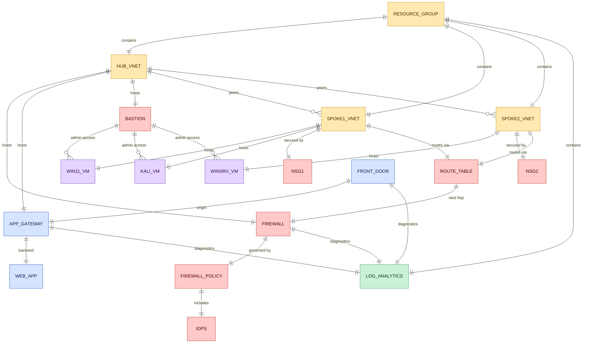

# Phase 1 Data Model: Azure Network Security Demo Lab Workshop

**Date**: 2026-06-18 | **Plan**: [plan.md](plan.md)

This lab has no application database. The "data model" is (a) the **configuration profile** that drives
every module and (b) the **resource entities** the lab provisions and their relationships. Field names
match the `$Global:Lab` hashtable in [`deploy/config.ps1`](../../deploy/config.ps1).

## Configuration profile (`$Global:Lab`)

| Field group | Key fields | Validation / rule |
|---|---|---|
| Identity | `Prefix`, `Suffix` | Short, deterministic; drive all resource names |
| Region | `Location` (default `westus`) | Single source; gated by `00-preflight` |
| Toggles | `EnableDdos` (false), `DeployFrontDoor`, `DeployAppGateway`, `DeployWebApp` | Booleans; control optional/cost-bearing stages |
| Compute | `VmSize` (`Standard_D2s_v3`), `Win11Image`, `KaliImage`, `WinSrvImage`, `WebAppContainerImage` | Image hashtables (Publisher/Offer/Sku/Version); validated per Principle I |
| Group | `ResourceGroup` (`rg-netsec-<suffix>`) | One RG holds the entire lab (enables one-step teardown) |
| Networking | `HubVnet`/`Spoke1Vnet`/`Spoke2Vnet`, subnet names, `*Prefix` address spaces, static VM IPs | CIDR layout below; reserved subnet names exact |
| Security | `FirewallName`, `FirewallPolicy`, `FirewallPip`, `Nsg1`, `Nsg2`, `RouteTable`, `DdosPlan` | Names deterministic; no Key Vault in core lab (see research Decision 3) |
| Compute names | `Win11Vm`, `KaliVm`, `WinSrvVm`, `Bastion`, `BastionPip`, `AdminUsername` | `AdminUsername=azureadmin`; password NOT stored |
| App delivery | `AppServicePlan`, `WebApp`, `AppGwName`, `AppGwPip`, `AppGwWafPolicy`, `FrontDoor*` | Front Door endpoint/WAF names alphanumeric |
| Monitoring | `Workspace` | One Log Analytics workspace receives all diagnostics |

### Address-space layout (CIDR)

| Network | Prefix | Subnets |
|---|---|---|
| Hub | `10.0.25.0/24` | `AzureFirewallSubnet 10.0.25.0/26`, `AGWAFSubnet 10.0.25.64/26`, `AzureBastionSubnet 10.0.25.128/26` |
| Spoke1 | `10.0.27.0/24` | `SPOKE1-SUBNET1 10.0.27.0/26` (Win11 `10.0.27.4`), `SPOKE1-SUBNET2 10.0.27.64/26` (Kali `10.0.27.68`) |
| Spoke2 | `10.0.28.0/24` | `SPOKE2-SUBNET1 10.0.28.0/26` (Win Server `10.0.28.4`) |

## Resource entities & relationships

> 🎨 **Colour key:** 🔵 web‑delivery edge (Front Door / App Gateway / web app) ·
> 🔴 security & access (Firewall / policy / IDPS / NSG / route table / Bastion) ·
> 🟣 lab VMs · 🟡 network containers (RG / VNets) · 🟢 monitoring (Log Analytics).

### State / lifecycle rules

- **Creation order** is fixed (Principle VI): RG → VNets/peering/PIPs → firewall/NSG/UDR → VMs/Bastion →
  WAF chain → monitoring. A resource is created only if absent (idempotent).
- **Forced tunneling**: spoke subnets associate `ROUTE_TABLE` whose `0.0.0.0/0` next hop is the
  firewall private IP (read dynamically after the firewall exists).
- **Deny-by-default**: each NSG allows Bastion RDP/SSH and intra-VNet, denies Internet inbound.
- **Teardown**: deleting `RESOURCE_GROUP` removes every entity above and stops billing.

## Key entity ↔ spec mapping

| Spec entity (spec.md) | Concrete resources |
|---|---|
| Hub network | `HUB_VNET` + firewall/gateway/bastion subnets |
| Spoke network | `SPOKE1_VNET`, `SPOKE2_VNET` + NSG + route table |
| Lab VM | `WIN11_VM`, `KALI_VM`, `WINSRV_VM` |
| Web protection chain | `FRONT_DOOR` → `APP_GATEWAY` → `WEB_APP` |
| Monitoring workspace | `LOG_ANALYTICS` |
| Configuration profile | `$Global:Lab` in `config.ps1` |
